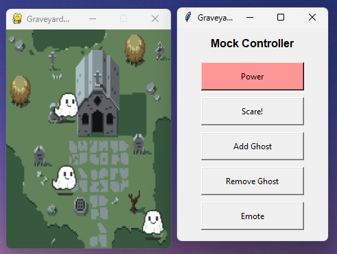

# ScaryPets

This project is meant to serve as the software side for a Scary Pets mobile device. Heavily in development, many updates to come, so stay tuned! 



## Installation

Use the provided requirements.txt file to install the necessary packages. This can be done running the following command in the root directory.

```bash
pip install -r requirements.txt
```

## Launching
Launch ScaryPets directly by running main.py in whichever pet you would like to run. For example:
```bash
python src/scarypets/ghost/main.py
```

## Emotes:
Each pet has a unique amount of "emotes" to give their character life. Below is a map of each emote possible for each pet.
#### Ghost
The ghost pet can choose from the following:
##### Candle

##### Heart

##### Pumpkin

##### Scare

##### Shy


## Future Updates

Going forward I plan on adding the instructions on how to build the portable version on a Raspberry Pi, including all parts used and a guide. I also want to add more fun pets! Much more to come, so stay tuned!

## Credits

All credits on this project go to [William Doyle](https://github.com/DoyleWill) as the sole developer.
